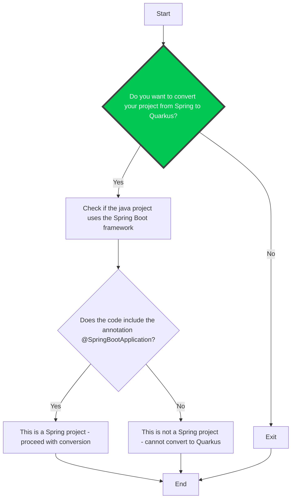

# Guide to migrate a Spring Boot application to Quarkus

The document helps you to migrate your Spring Boot 3.x application to Quarkus 3.x.

**Remark**: To validate guide and under the hood the rules it refers like the instructions, we selected initially as project: https://github.com/adampeer/spring-boot-todo-app. When new iterations of this guide will occur, then we will enrich the collection of the projects with Spring Boot Petclinic and more for each new starters integrated.

## Constraints

*This section lists the technical constraints, limitations of the existing analysing tool and identify improvements and new rules to be developed in the future*

- The Migration tool currently cannot migrate a maven multi-modules project
- Maven is the only tool currently supported to migrate a project

## Before you start

- Before you start the migration, make sure you committed your latest changes on your code source repository
- Create a new branch to save the changes you will apply manually or using a tool during the migration. 
- Identify too, the Quarkus version you would like to use, otherwise we will use the latest available !
- To analyze your code, verify that you have installed locally the Migration & Analysing tool: x.y.z or you have access to such a tool online.

TODO: Add link to the documentation of the Migration tool explaining what todo, how to upload (select) a project to migrate like the source and the target platform.

## Review System Requirements

- Quarkus 3.x requires Java 17 or later. 
- Apache Maven 3.9.x
- Optionally: [Quarkus CLI](https://quarkus.io/guides/cli-tooling).

## How to test and debug the rules

This project provides a Quarkus CLI application able to analyze and transform a java Spring Boot project and to validate it against the rules created.

## Migration path

Two migration paths are currently possible, depending on what you prefer todo. They share somme common tasks able to manipulate the maven pom, but they will diverge when dependencies will be involved like the java annotations proposed or code refactoring.

| Target Platform                             | Compatibility layer with Spring                               | Effort estimated |
|---------------------------------------------|---------------------------------------------------------------|------------------|
| [Quarkus](#moving-to-quarkus)               | No                                                            | High             |
| [Quarkus Spring](#moving-to-quarkus-spring) | [Yes](https://quarkus.io/blog/quarkus-for-spring-developers/) | Moderate         |

### Common steps

Verify first that the licensing model of your project allows to migrate your code to Quarkus 3.x which relies on Apache License 2 - [rule-compatibility-oss-license.md](rules/rule-compatibility-oss-license.md). If your Spring Boot project uses Apache License 2.0, MIT, or BSD licenses, migration to Quarkus is straightforward. For GPL or proprietary licenses, consult with legal counsel before proceeding.

At the condition that you have installed Java 17 - [rule-presence-java.md](rules/rule-presence-java.md) and Apache Maven 3.9 - [rule-presence-maven.md](rules/rule-presence-maven.md), then we can start the process to migrate.

Open the `pom.xml` file and verify that your project is not defined as a maven multi-modules project - [rule-multi-maven-modules.md](rules/rule-multi-maven-modules.md). If this is the case, then you will have to perform different steps manually as the tool don't support (yet) such a structure !

We can now start the process using a simple decision tree or flowchart that we will follow in order to take different decisions based on conditions defined within rules
and validated.

[spring-to-quarkus.mmd](diagrams/spring-to-quarkus.mmd)



#### Replace the Spring Boot parent with the Quarkus BOM

Open your project's pom.xml file and remove the section (see [rule-migrate-parent-pom-to-bom.md](rules/rule-migrate-parent-pom-to-bom.md)) encompassing the Spring Boot `<parent>` and `</parent>` tags.

```xml
<parent>
    <groupId>org.springframework.boot</groupId>
    <artifactId>spring-boot-starter-parent</artifactId>
    <version>xxx</version>
    <relativePath/>
</parent>
```
Next declare under the `<dependencyManagement>/<dependencies>` tag a dependency referring the Quarkus BOM 

```xml
<dependencyManagement>
    <dependencies>
        <dependency>
            <groupId>io.quarkus.platform</groupId>
            <artifactId>quarkus-bom</artifactId>
            <version>${quarkus.platform.version}</version>
            <type>pom</type>
            <scope>import</scope>
        </dependency>
    </dependencies>
</dependencyManagement>
```

#### Set the Quarkus version

The `quarkus.platform.version` property should be declared (see [rule-migrate-set-quarkus-version.md](rules/rule-migrate-set-quarkus-version.md)) part of the `<properties>` tag and set using the following version.

```xml
<properties>
    <quarkus.platform.version>3.x.x</quarkus.platform.version>
</properties>
```

#### Change the Java version (optional)

As the recommended version of Quarkus 3.x is Java >= 17, then you will have to update (see [rule-change-maven-compiler-version.md](rules/rule-change-maven-compiler-version.md) ) the `<maven.compiler.xxx>` properties to align the versions of the following properties.
```xml
<properties>
    <maven.compiler.source>17</maven.compiler.source>
    <maven.compiler.target>17</maven.compiler.target>
</properties>
```

#### Replace the Spring Boot plugin with the Quarkus one

To fully benefit of the Quarkus features to compile your project, launch the quarkus mode, build an image, deploy, etc. then it is needed to remove the Spring Boot plugin (see [rule-change-migrate-springboot-plugin-to-quarkus-plugin.md](rules/rule-change-migrate-springboot-plugin-to-quarkus-plugin.md))from the pom.xml file

```xml
<!-- Remove the Spring Boot plugin -->
<build>
    <plugins>
        <plugin>
            <plugin>
                <groupId>org.springframework.boot</groupId>
                <artifactId>spring-boot-maven-plugin</artifactId>
            </plugin>
        </plugin>
    </plugins>
</build>
```
and to add the [Quarkus maven plugin](https://quarkus.io/guides/quarkus-maven-plugin)
```xml
<build>
    <plugins>
        <plugin>
            <groupId>io.quarkus.platform</groupId>
            <artifactId>quarkus-maven-plugin</artifactId>
            <version>${quarkus.platform.version}</version>
            <extensions>true</extensions>
            <executions>
                <execution>
                    <goals>
                        <goal>build</goal>
                        <goal>generate-code</goal>
                        <goal>generate-code-tests</goal>
                    </goals>
                </execution>
            </executions>
        </plugin>
    </plugins>
</build>
```

### Moving to Quarkus Spring

The migration path that we will cover here allows you to leverage your existing Spring knowledge and even reuse significant portions of your code while gradually adopting Quarkus' native features. Different Quarkus extensions have been developed for that purpose and provide familiar annotations and patterns, reducing the initial learning curve and enabling an incremental migration strategy.

**Important**: Some limitations currently exist as some of the Java Spring annotations have not been implemented or are irrelevant when running in Quarkus. Refer to the official Quarkus Spring guides to have a full picture of the story !  

### Moving to Quarkus

TODO

TO BE CONTINUED !

## Useful links

### Examples of projects to be tested

- **From**: Spring Boot todo application - https://github.com/adampeer/spring-boot-todo-app
- **To**: Quarkus todo application - https://github.com/quarkusio/todo-demo-app

### Rules processed by an analyzer tool

- Existing analysing rules of konveyor - https://github.com/konveyor/rulesets/tree/main/default/generated/quarkus

### Recipes to transform
 
- Openrewrite recipes:
  - Java: https://docs.openrewrite.org/recipes/java
  - Maven: https://docs.openrewrite.org/recipes/maven
  - Quarkus: https://docs.openrewrite.org/recipes/quarkus

### Migration guide example 

1. Red Hat work - Eric and Daniel

- https://docs.google.com/document/d/158WMNNpQ_BbNFMztstqoCoEDwhH8I9qzmC0NV3tJZhk/edit?tab=t.0

2. Spring Petclinic to Quarkus (french)

- Very valuable project as it covers more complex aspect of the migration and cover the move from Thymeleaf to Qute: https://javaetmoi.com/2025/04/spring-petclinic-sous-extensions-quarkus/

3. Markus blog's posts

- https://www.the-main-thread.com/p/spring-to-quarkus-without-the-rewrite
- https://www.the-main-thread.com/p/spring-to-quarkus-move-your-java
- https://www.the-main-thread.com/p/spring-to-quarkus-migration-guide

4. Openrewrite & migration tools

- SpringBoot migration tool using YAML actions definition to generate recipes from project converted to AST: https://github.com/spring-projects-experimental/spring-boot-migrator/?tab=readme-ov-file
- In depth covering of openrewrite features: https://github.com/SimonVerhoeven/openrewrite-demo
- Quarkus 1.x to 2.x: https://docs.openrewrite.org/running-recipes/popular-recipe-guides/quarkus-2.x-migration-from-quarkus-1.x
- Spring Boot 2.x to 3.x: https://docs.openrewrite.org/running-recipes/popular-recipe-guides/migrate-to-spring-3


